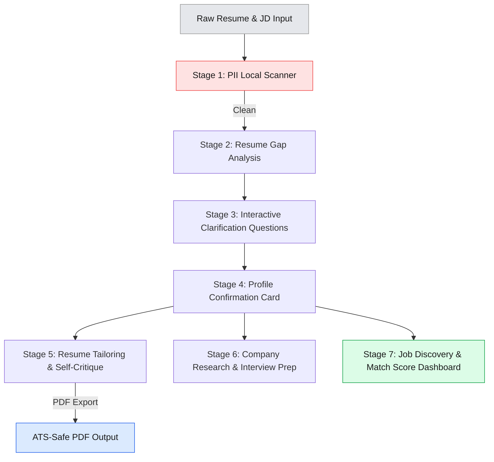

# CareerCraft AI: A Multi-Agent Career Concierge

**Track:** Concierge Agents
**Subtitle:** From resume to interview, one pipeline of specialized agents that prepares you for the job you actually want.

---

## The Problem

Every job application quietly asks the candidate to do four jobs at once: rewrite the resume to match the role, prepare interview answers that hold up under questioning, learn enough about the company to sound informed, and figure out which opportunities are actually worth the effort in the first place.

Most people don't have hours to spend per application, so corners get cut. The resume stays generic. Interview prep happens the night before, if at all. Company research is a skim of the About page. The result is candidates who are genuinely qualified but underprepared — losing ground to people with more time, not more skill.

CareerCraft AI exists because thorough job search preparation shouldn't require a part-time job of its own.

---

## The Solution — Why Agents

This isn't a single-prompt problem.

Tailoring a resume, writing grounded STAR stories, researching a company, and surfacing matching opportunities are four different tasks with different inputs, different failure modes, and different quality bars. Ask one large prompt to do all of this at once and the work blurs together: resume bullets that read like interview answers, STAR stories that ignore the actual job description, research that never surfaces in the final output.

Splitting the work across specialized agents, each with a narrow job and a clear handoff, solves this directly. The Resume Analyst only parses and flags gaps. The Resume Tailoring Agent only worries about matching the resume to the job description, and runs its own self-critique pass before the draft moves downstream. The Interview Prep Agent only generates STAR answers grounded in the candidate's real history — it's explicitly instructed to say "no matching experience" rather than invent one. The Company Research and Job Discovery Agents only pull current, live information through search, because a language model's training data is never going to know what a company posted this week.

Just as important as what each agent does is what the person gets to see and correct along the way. CareerCraft AI pauses twice for explicit human review: once to confirm the parsed profile before anything gets tailored, and once to approve the tailored resume before moving on to interview prep and job search. Nothing advances on the candidate's behalf without a chance to say "wait, that's not right."

---

## Architecture

Seven stages, six `google.adk.Agent` objects, and six single-purpose "bounded" skills that keep the deterministic parts of the pipeline out of the LLM's hands entirely.

**Stage 1 — PII Local Scanner.** A pure-regex guardrail — no LLM call, no token cost — blocks phone numbers, dates of birth, home addresses, and national ID patterns before anything reaches Gemini. If it finds something, the session pauses with an advisory instead of silently proceeding.

**Stages 2–4 — Intake.** The Resume Analyst Agent parses the resume into a structured gap report. A Clarifying Questions pass asks only about what's genuinely missing or thin (target role, location preference, work mode are almost never in a resume). The candidate reviews a compact profile card and confirms it — HITL checkpoint one.

**Stage 5 — Tailoring.** The JD Parser Agent extracts required and preferred skills from the job description. A bounded Match-and-Gap skill scores the fit with weighted logic (required skills 70%, preferred 30% — no LLM call, pure Python) and ranks the candidate's strongest bullets for that specific role. The Resume Tailoring Agent writes the draft, a Resume Self-Critique skill flags vague verbs, missing numbers, and buried impact — grounded strictly against metrics the candidate actually provided, never inventing a number — and a revision pass fixes what it can. The result exports to an ATS-safe PDF via ReportLab. Human checkpoint two: the candidate reviews the tailored resume before it counts as final.

**Stage 6 — Company Research & Interview Prep (parallel).** These two agents both run off the confirmed profile and use ADK's built-in `google_search` tool as an MCP-style grounding source, so answers about "what's this company been up to lately" come from this week's web, not the model's training data. Interview questions get sorted into behavioral / technical / role-specific buckets by priority before the Interview Prep Agent spends tokens answering them, and every STAR answer is required to name the specific company or project it's drawn from.

**Stage 7 — Job Discovery & Dashboard.** A search-grounded agent finds current postings; a bounded Freshness Filter drops anything older than 14 days, flags anything 7–14 days old, and — critically — rebuilds every apply link from the structured job title, company, and location fields rather than trusting whatever URL the model generated. That fix came directly from a bug: the model was producing plausible-looking apply URLs that 404'd, because it was inventing them rather than reporting them.

**Dynamic routing and resource optimization.** LLM calls are split across two Gemini API projects: `gemini-2.5-flash` (Project 1) handles the quality-critical generation — resume tailoring, JD parsing, interview answers — while `gemini-2.5-flash-lite` (Project 2) handles the lighter, higher-volume calls — parsing, classification, and the two search-grounded agents. `call_gemini()` inspects the model parameter at call time and dispatches to the correct client, so the routing is dynamic rather than hardcoded per-agent. Splitting the load across two projects keeps the whole pipeline inside free-tier quota without downgrading the calls that actually need the stronger model.

Every agent call — name, stage, token count, status, error — is logged to a session trajectory and summarized in an audit table at the end of a run, and the entire pipeline can run end-to-end on mock data with zero live API calls for testing or demo purposes.

---

## Course Concepts Demonstrated

| Concept | Where |
|---|---|
| Multi-agent system (ADK) | Six `google.adk.Agent` objects coordinated through `Runner` and `InMemorySessionService`, each scoped to one responsibility |
| MCP-style tool integration | ADK's built-in `google_search` tool grounds the Company Research and Job Discovery agents in live web results |
| Security features | Local regex-only PII scanner as a mandatory pre-LLM guardrail; API keys loaded from Kaggle Secrets / environment variables, never hardcoded |
| Agent skills | Six `SKILL.md` packages (PII Scanner, Gap Report Generator, Match and Gap Analyzer, Resume Self-Critique, Interview Question Classifier, Job Freshness Filter) under `agentskills.io`-style YAML frontmatter, loaded on demand |

---

## The Journey

The build surfaced real bugs, not hypothetical ones. A `name 'client' is not defined` error turned out to be a one-word mismatch — `call_gemini()` was correctly routing to `active_client` but then calling the undefined generic `client` on the actual API line. The resume PDF export was silently dropping the candidate's name, email, LinkedIn, and education because those fields were never added to the schema in the first place; adding them to `EnrichedProfile` and the extraction prompt fixed it. A regex word-boundary bug in the PDF renderer, an HTML clipboard-escaping bug, and a mismatched PDF export path all had to be tracked down and patched one at a time.

Two fixes came from watching the live pipeline instead of the mocked one. The retry logic only caught `429`/`RESOURCE_EXHAUSTED` errors, so a transient `503`/`UNAVAILABLE` from the API would crash the run instead of backing off and retrying — adding those codes to the retry condition fixed it. And the job discovery agent was writing `apply_url` as free text inside its JSON output, which meant Gemini was inventing plausible-but-fake job links that returned 404s. The fix was to stop asking the model for a URL at all — a `build_job_search_url()` helper now constructs a guaranteed-valid LinkedIn search link from the structured `job_title`, `company`, and `location` fields the model did extract correctly. A related fix: `target_role`, `target_seniority`, and `location_preference` kept showing up as "Not set" on the confirmation card even after the candidate answered the clarifying questions directly — traced to the parsing prompt never explicitly requiring those keys in its JSON output, with no `.setdefault()` safety net to catch the gap.

None of these were exotic failures. They were the ordinary cost of connecting an LLM to a real, multi-step pipeline with real users at the other end — and the fix, every time, was the same instinct: don't trust the model for anything a deterministic function can verify instead.

---

## Closing

CareerCraft AI isn't trying to write the model's opinion of a good resume. It's trying to do the unglamorous, time-consuming work a thorough candidate would do anyway — parse honestly, ask what's missing, tailor without inventing, ground every claim in something real, and hand the wheel back to the candidate at every point that matters — just faster, and without the part-time job attached.
