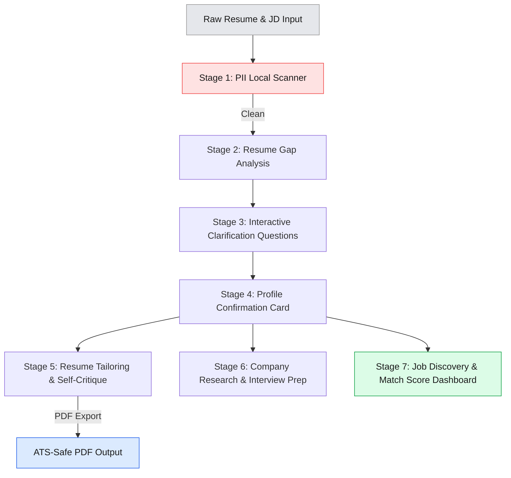

# CareerCraft AI: A Multi-Agent Career Concierge

**Track:** Concierge Agents · **5-Day AI Agents Intensive — June 2026 (Kaggle Capstone)**

CareerCraft AI is a pipeline of specialized **Google ADK 2.0** agents that takes a raw resume and job description and turns them into a tailored, ATS-safe resume, grounded STAR-format interview answers, live company research, and a scored job-opportunity dashboard — with human-in-the-loop checkpoints at every decision point that matters.

---

## Architecture

A 7-stage pipeline, built entirely on `google.adk.Agent` objects, with two Human-in-the-Loop (HITL) checkpoints (profile confirmation, resume review) and two agents designed to run in parallel at Stage 6 (company research + interview prep), grounded via an MCP-style `google_search` tool.

---

## Key Features

- **7-stage agent pipeline** — intake/PII scan → gap analysis → clarification → confirmation → tailoring → parallel research/prep → job discovery & dashboard.
- **6 ADK LLM agents**, each scoped to a single responsibility, plus **6 bounded skills** — single-purpose, schema-constrained functions (some pure logic, some lightweight LLM calls) that keep each step auditable and cheap.
- **HITL checkpoints** — the pipeline pauses for explicit user confirmation before tailoring the resume, and again after the tailored draft is produced, so nothing moves to the next stage without the user's review.
- **Dual-project API quota routing** — LLM calls are split across two separate Gemini API keys/projects (`gemini-2.5-flash` for heavier generation, `gemini-2.5-flash-lite` for parsing/extraction and search-grounded agents), reducing the chance of hitting a single project's rate limit.
- **MCP-style live grounding** — Company Research and Job Discovery agents use ADK's built-in `google_search` tool so outputs are grounded in current web results rather than model memory.
- **Freshness filtering** — job postings older than 14 days are dropped, postings 7–14 days old are flagged, and apply links are rebuilt from structured fields (title/company/location) rather than trusting model-generated URLs, to avoid hallucinated deep links.
- **Local PII scanner** — a pure-regex guardrail (no LLM call, no token cost) blocks phone numbers, DOB, home address, and national ID patterns from ever reaching an LLM.
- **Resume self-critique loop** — the tailoring agent revises its own output against JD requirements before final export (bounded to `MAX_REVISIONS`).
- **Session persistence & resume** — enriched profile state is checkpointed to disk after each confirmed stage, so a session can be resumed without repeating PII scan → gap analysis → clarification.
- **Full observability** — every agent call is logged (agent name, stage, token count, status, error) and summarized in a trajectory audit table at the end of a run.
- **Mock mode (`USE_MOCK`)** — the entire pipeline can run end-to-end on canned data with zero API calls, for testing and demo purposes.
- **Resilient API layer** — exponential backoff with jitter on `429` / `503` / `RESOURCE_EXHAUSTED` / `UNAVAILABLE` errors for both the raw Gemini client and the ADK runner.

---

## Agent Inventory

| # | Agent | Model | Stage | Tools | Purpose |
|---|-------|-------|-------|-------|---------|
| 1 | `resume_analyst_agent` | `gemini-2.5-flash-lite` | 2 | — | Parses raw resume into a structured gap report (skills, bullets, missing fields) |
| 2 | `jd_parser_agent` | `gemini-2.5-flash-lite` | 5 | — | Parses job description into required/preferred skills, responsibilities, culture signals |
| 3 | `resume_tailoring_agent` | `gemini-2.5-flash` | 5 | — | Tailors resume to the JD with self-critique revisions; never invents metrics |
| 4 | `interview_prep_agent` | `gemini-2.5-flash` | 6 | — | Generates STAR-format answers grounded only in the user's real experience |
| 5 | `company_research_agent` | `gemini-2.5-flash-lite` | 6 | `google_search` (MCP-style) | Researches recent news, products, culture, interview patterns for the target company |
| 6 | `job_discovery_agent` | `gemini-2.5-flash-lite` | 7 | `google_search` (MCP-style) | Finds fresh (≤14 day) job postings matching the target role and location |

## Bounded Skills

| Skill | LLM call? | Purpose |
|-------|-----------|---------|
| **PII Scanner** | No — regex only | Blocks phone numbers, DOB, home address, and national ID patterns before any LLM call; pauses the session if PII is found |
| **Gap Report Generator** | No — pure logic | Structures the resume analyst's raw output into a validated gap report (`extracted` / `needs_clarification` / `missing_entirely`); internal only, never shown to the user |
| **Match and Gap Analyzer** | No — pure logic | Weighted scoring against the JD (required skills 70%, preferred skills 30%); returns `match_score`, gap lists, and the top 6 most relevant bullets to highlight |
| **Resume Self-Critique** | Yes — `gemini-2.5-flash-lite` | Flags vague verbs, missing numbers, passive voice, and buried impact in the tailored draft; never suggests inventing metrics; drives the Pass-3 revision |
| **Interview Question Classifier** | Yes — `gemini-2.5-flash-lite` | Sorts raw interview questions into behavioral / technical / role-specific categories with high/medium/low priority, so prep tokens go to the highest-value questions first |
| **Job Freshness Filter** | No — pure logic | Drops postings older than 14 days, flags postings 7–14 days old, adjusts match score by posting age, and rebuilds apply URLs from structured fields, returning the top 5 by score |

All six are packaged as `SKILL.md` files under `agentskills.io`-style YAML frontmatter (name, description, trigger, input/output schema) for progressive disclosure — loaded on demand rather than at startup. "Bounded" here means single-purpose and schema-constrained, not necessarily LLM-free — two of the six make a lightweight, schema-enforced call to `gemini-2.5-flash-lite` rather than a full agent turn.

---

## Data Model

- **`EnrichedProfile`** — the canonical user state object carried through the pipeline: identity fields (name, email, LinkedIn, education), parsed experience (companies, skills, bullets with `has_numbers` flags), target role/seniority/industry/location, and a `confirmation_status` (`pending` / `confirmed` / `manual_edit`).
- **`JDObject`** — structured job description: company, role, seniority, required/preferred skills, responsibilities, culture signals.
- **`JobRecord`** — one discovered job posting: title, company, location, work mode, post date, freshness warning, match score, gap skills, apply URL.

---

## Setup

1. Open the notebook in Kaggle.
2. Go to **Add-ons → Secrets** and add:
   - `GEMINI_API_KEY` — Gemini API key for Project 1 (`gemini-2.5-flash`)
   - `GEMINI_API_KEY_2` — Gemini API key for Project 2 (`gemini-2.5-flash-lite`)
   - `SEARCH_API_KEY` — Google Custom Search API key
   - `SEARCH_ENGINE_ID` — Programmable Search Engine ID
3. Optionally set `USE_MOCK = True` in Cell 1 to run the full pipeline with zero live API calls.
4. Run cells top to bottom. Interactive stages (clarification, confirmation) use `ipywidgets` and pause for user input — read the cell instructions before running the next cell.

**Dependencies:** `google-genai`, `google-adk`, `nest-asyncio`, `pypdf`, `pdfminer.six`, `ipywidgets`, `reportlab`.

---

## How to Run

| Cells | What happens |
|-------|--------------|
| 1 – 1b | Environment setup, session/logging helpers, Gemini client, ADK agent definitions, connectivity tests |
| 2 – 4 | Enriched profile schema, `SKILL.md` package generation |
| 5 – 5a | PII scanner skill; resume/JD input widgets |
| 6 – 7c | Resume gap analysis → clarifying questions (interactive) → enriched profile |
| 8 – 8b | **HITL Checkpoint 1** — profile confirmation card |
| 9 – 11b | JD parsing → match/gap skill → resume tailoring with self-critique → PDF export → **HITL Checkpoint 2** (resume review) |
| 12 – 14a | Interview question classification → STAR interview prep → company research |
| 15 – 16a | Job discovery with freshness filtering → opportunity dashboard rendering |
| 17 – 17a | Full-pipeline orchestrator (including session resume logic) |
| 18 | Trajectory log summary — full audit of every agent call, tokens, and errors |

---

## Notes & Known Limitations

- Job `apply_url` values are always rebuilt from structured (title, company, location) fields into a LinkedIn search URL rather than trusting model-generated deep links, since those can be fabricated.
- The pipeline is designed to degrade gracefully: if job discovery returns zero results, a fallback message is shown rather than failing the whole session; if PII is detected, the session pauses with an explicit advisory rather than silently stripping data.
- Live runs are subject to Gemini API rate limits; retries use exponential backoff with jitter, but heavy `503`/`RESOURCE_EXHAUSTED` periods can still slow a live end-to-end run.

---

## Author

Built by Ramya Ponnuvel Rajathy for the Google 5-Day AI Agents Intensive (June 2026), Concierge Agents track.
